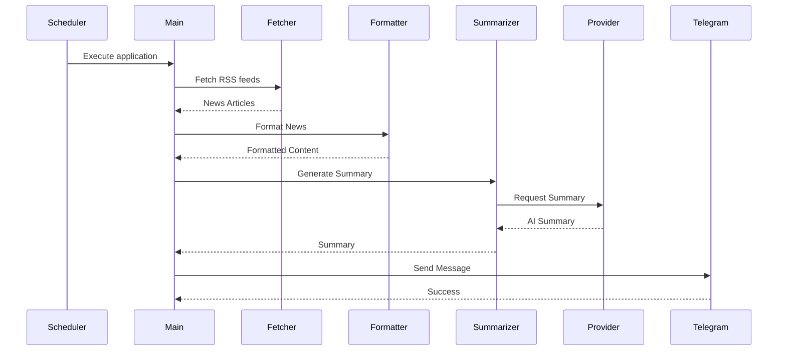
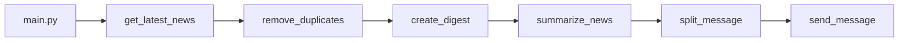
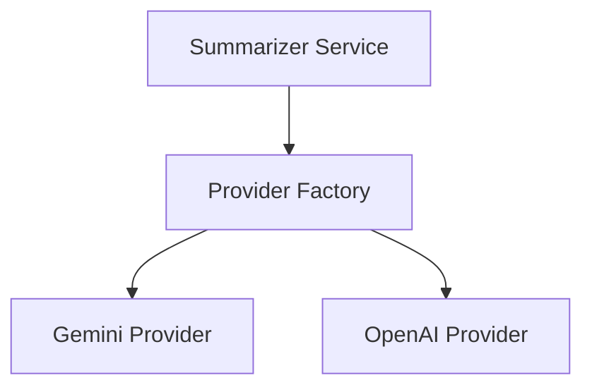
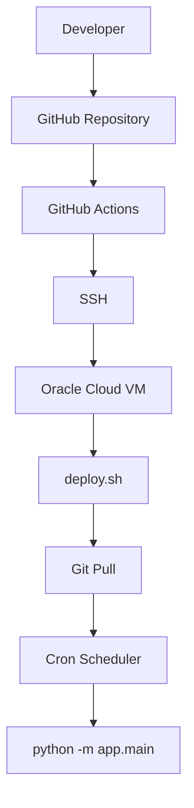

# Application Architecture

This document describes the architecture of the AI News Telegram Bot, the responsibilities of each module, and the design decisions behind the implementation.

---

# Table of Contents

- Architecture Overview
- Design Principles
- High-Level Workflow
- Project Structure
- Module Responsibilities
- Execution Flow
- Provider Architecture
- Data Flow
- Deployment Architecture
- Configuration Management
- Logging
- Future Enhancements

---

# Architecture Overview

The AI News Telegram Bot is a modular Python application that automates the collection, summarization, and delivery of Artificial Intelligence news.

The application follows a layered architecture where each module has a single responsibility.

```mermaid
graph TD

classDiagram

class BaseProvider {
    +summarize()
}

class GeminiProvider
class OpenAIProvider

BaseProvider <|-- GeminiProvider
BaseProvider <|-- OpenAIProvider

class ProviderFactory {
    +get_provider()
}

ProviderFactory --> BaseProvider


A[RSS News Sources]
--> B[News Fetcher]

B --> C[Remove Duplicates]

C --> D[News Formatter]

D --> E[Summarizer Service]

E --> F[Provider Factory]

F --> G[Gemini Provider]

F --> H[OpenAI Provider]

G --> I[Telegram Bot]

H --> I

I --> J[Telegram Chat]
```

---

# Design Principles

The application is designed around the following software engineering principles.

## Separation of Concerns

Each package performs a single responsibility.

Examples:

- Fetching news
- Formatting content
- AI summarization
- Telegram communication

Each responsibility is isolated from the others.

---

## Modular Design

Features are organized into packages.

Benefits:

- Easier maintenance
- Better readability
- Easier testing
- Easier extension

---

## Provider Pattern

Different AI providers implement a common interface.

Current providers:

- Gemini
- OpenAI

Adding another provider should not require changes to the application flow.

---

## Configuration Driven

Sensitive values are stored in environment variables instead of source code.

Examples:

- API Keys
- Telegram Bot Token
- Chat ID

---

# High-Level Workflow

The complete execution flow is shown below.



---

# Project Structure

```
AI-News-Telegram-Bot
│
├── app/
├── common/
├── news/
├── providers/
├── prompts/
├── services/
├── telegram/
├── scripts/
├── docs/
├── tests/
└── logs/
```

---

# Module Responsibilities

## app

Contains the application entry point.

Responsibilities:

- Start application
- Coordinate workflow
- Load configuration

Files:

```
main.py
config.py
```

---

## common

Contains reusable components shared across the application.

Responsibilities:

- Logging
- Utility functions

Files:

```
logger.py
utils.py
```

---

## news

Responsible for collecting and preparing news.

Responsibilities:

- RSS feed retrieval
- Duplicate removal
- Message formatting

Files:

```
fetcher.py

formatter.py

sources.py
```

---

## providers

Contains implementations of AI providers.

Current providers:

- Gemini
- OpenAI

Responsibilities:

- Connect to AI API
- Generate summaries
- Return standardized responses

---

## prompts

Contains reusable prompt templates.

Separating prompts from provider logic makes prompts:

- easier to maintain
- reusable
- version controlled

---

## services

Contains business logic.

Current service:

```
summarizer.py
```

Responsibilities:

- Build prompts
- Call provider factory
- Return summaries

---

## telegram

Responsible for communication with Telegram.

Responsibilities:

- Split long messages
- Send messages
- Handle Telegram API

---

## scripts

Contains automation scripts.

Examples:

```
run.sh

deploy.sh
```

---

## docs

Contains project documentation.

---

## tests

Contains unit tests.

---

# Execution Flow

The following diagram shows the internal execution.



---

# Provider Architecture

The project uses the Provider Pattern.



Advantages:

- Loose coupling
- Easy extensibility
- Cleaner code
- Easier testing

Future providers may include:

- Claude
- Azure OpenAI
- Ollama
- HuggingFace
- Groq

---

# Data Flow

The application processes data in the following order.

```text
RSS Feed

↓

News Articles

↓

Remove Duplicates

↓

Formatted News

↓

Prompt Creation

↓

AI Summary

↓

Telegram Message

↓

Telegram Chat
```

---

# Deployment Architecture

Production deployment uses Oracle Cloud.



Responsibilities:

GitHub Actions

- Deployment

Oracle VM

- Hosting

Cron

- Scheduling

Application

- Business Logic

---

# Configuration Management

Application configuration is centralized.

Configuration source:

```
.env
```

Examples:

- BOT_TOKEN
- CHAT_ID
- AI_PROVIDER
- GEMINI_API_KEY
- OPENAI_API_KEY

The application reads these values during startup.

---

# Logging

Logging is centralized.

Current logger:

```
common/logger.py
```

Logging should be used instead of print statements.

Benefits:

- Easier debugging
- Production monitoring
- Persistent logs

---

# Design Decisions

## Why use Packages?

Packages group related functionality together, improving maintainability and scalability.

---

## Why use the Provider Pattern?

To allow multiple AI providers without changing the application workflow.

---

## Why separate prompts?

Prompt engineering evolves independently of provider implementations. Keeping prompts separate makes them reusable and easier to update.

---

## Why use Cron instead of GitHub Scheduled Workflows?

The application is deployed on an Oracle Cloud VM, which runs continuously. Cron provides:

- Better reliability
- Simpler scheduling
- Full control over execution
- Independence from GitHub Actions

GitHub Actions is used exclusively for deployment.

---

## Why Oracle Cloud?

Oracle Cloud Always Free provides:

- Persistent virtual machine
- SSH access
- Cron scheduling
- No recurring hosting cost for eligible resources

---

# Future Architecture

Planned enhancements include:

```text
                +------------------+
                |  RSS Sources     |
                +--------+---------+
                         |
                         v
                 News Processing
                         |
          +--------------+-------------+
          |                            |
          v                            v
   AI Summarization           Duplicate Detection
          |                            |
          +--------------+-------------+
                         |
                  Category Classification
                         |
                         v
                  Storage Database
                         |
          +--------------+-------------+
          |                            |
          v                            v
      Telegram                    Email Digest
          |
          v
      Slack / Discord
```

---

# Summary

The AI News Telegram Bot is designed as a modular, extensible, and maintainable application.

The architecture emphasizes:

- Separation of Concerns
- Provider Pattern
- Modular Packages
- Configuration Management
- Automated Deployment
- Production Scheduling
- Extensibility

This design allows new AI providers, news sources, messaging platforms, and deployment targets to be added with minimal impact on the existing codebase.

## Related Documentation

- README.md — Project overview and quick start
- ARCHITECTURE.md — System design and module interactions
- DEVELOPMENT.md — Local development and contribution guide
- DEPLOYMENT.md — Oracle Cloud deployment instructions
- CI_CD.md — Deployment automation pipeline