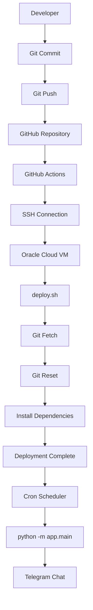
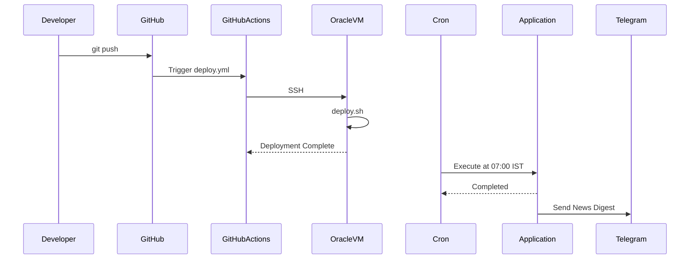

# CI/CD Pipeline

This document describes the Continuous Integration and Continuous Deployment (CI/CD) pipeline used by the AI News Telegram Bot.

The project uses **GitHub Actions** for automated deployment and an **Oracle Cloud VM** with **Linux Cron** for scheduled execution.

---

# Table of Contents

- Overview
- CI/CD Architecture
- Workflow
- GitHub Actions
- Oracle Cloud VM
- Deployment Script
- Cron Scheduler
- Deployment Flow
- Rollback Strategy
- Troubleshooting

---

# Overview

The deployment pipeline is designed with two distinct responsibilities:

| Component | Responsibility |
|------------|----------------|
| GitHub Actions | Deploy the latest code to the Oracle Cloud VM |
| Oracle Cloud VM | Host the application |
| Linux Cron | Execute the application every day |
| Git | Version control |

Unlike many small projects, **GitHub Actions is not responsible for running the application daily**. It is only responsible for deploying the latest version whenever changes are pushed to the repository.

---

# CI/CD Architecture



---

# Deployment Workflow

The deployment process follows these steps.

## Step 1

Developer commits code.

```bash
git add .

git commit -m "Add new feature"
```

---

## Step 2

Developer pushes code.

```bash
git push origin main
```

---

## Step 3

GitHub automatically detects the push.

The `deploy.yml` workflow is triggered.

---

## Step 4

GitHub Actions connects to the Oracle Cloud VM using SSH.

Authentication is performed using:

- VM Public IP
- SSH Private Key
- Ubuntu User

---

## Step 5

The deployment script executes on the VM.

Example operations:

- Change to project directory
- Fetch latest changes
- Reset to latest commit
- Install dependencies

---

## Step 6

Deployment completes.

The application is now updated.

No restart is required because the application is executed on demand by Cron.

---

# GitHub Actions

The repository contains two workflow files.

```
.github/workflows/
```

## deploy.yml

Responsible for deployment.

Triggered by:

```yaml
on:
  push:
    branches:
      - main
```

Responsibilities:

- SSH into Oracle VM
- Execute deployment script
- Update application

---

## daily.yml

Originally used to schedule the application.

After migrating to Oracle Cloud Cron, scheduling is performed by the VM instead of GitHub Actions.

The workflow may be:

- retained for manual execution using `workflow_dispatch`, or
- removed if no longer required.

---

# Oracle Cloud VM

The Oracle Cloud VM serves as the production environment.

Responsibilities:

- Host application
- Maintain Python virtual environment
- Execute Cron jobs
- Store logs
- Receive deployments

Application location:

```
/home/ubuntu/projects/AI-News-Telegram-Bot
```

---

# Deployment Script

Deployment is performed using:

```
scripts/deploy.sh
```

Typical tasks:

```bash
cd ~/projects/AI-News-Telegram-Bot

git fetch origin

git reset --hard origin/main

source .venv/bin/activate

pip install -r requirements.txt
```

The deployment script ensures the server always matches the latest version in the GitHub repository.

---

# Scheduler

Application execution is handled by Linux Cron.

Example Cron entry:

```cron
30 1 * * * /home/ubuntu/projects/AI-News-Telegram-Bot/scripts/run.sh
```

This executes the bot every day at:

```
07:00 IST
```

The `run.sh` script activates the virtual environment and starts the application.

Example:

```bash
#!/bin/bash

set -e

cd /home/ubuntu/projects/AI-News-Telegram-Bot

source .venv/bin/activate

python3 -m app.main
```

---

# Deployment Flow



---

# Environment Variables

The deployment depends on the following environment variables.

```
BOT_TOKEN

CHAT_ID

AI_PROVIDER

GEMINI_API_KEY

OPENAI_API_KEY
```

These values are stored in:

```
.env
```

The `.env` file is never committed to Git.

---

# Deployment Verification

After every deployment, verify:

## Latest Commit

```bash
git log --oneline -5
```

---

## Application Starts

```bash
python -m app.main
```

---

## Cron Entry

```bash
crontab -l
```

---

## Cron Service

```bash
sudo systemctl status cron
```

---

## Deployment Logs

GitHub Actions provides deployment logs for every execution.

Oracle VM logs can be checked using:

```bash
tail -f logs/app.log
```

or

```bash
grep CRON /var/log/syslog
```

---

# Rollback Strategy

If deployment fails:

## Step 1

Identify a previous stable commit.

```bash
git log --oneline
```

---

## Step 2

Reset the repository.

```bash
git reset --hard <commit_hash>
```

---

## Step 3

Restart the application by manually executing:

```bash
python -m app.main
```

---

# Troubleshooting

## Deployment not updating the server

Check:

```bash
git status
```

The working tree should be clean.

---

## SSH connection fails

Verify:

- Public IP
- SSH Key
- Security List
- Port 22

---

## GitHub Action succeeds but code is unchanged

Verify that:

```
git reset --hard origin/main
```

is used instead of:

```
git pull
```

This prevents deployment failures caused by local modifications on the VM.

---

## Cron job does not execute

Verify:

```bash
crontab -l
```

Check:

```bash
sudo systemctl status cron
```

Review logs:

```bash
grep CRON /var/log/syslog
```

---

## Python Module Errors

Always execute the application using:

```bash
python3 -m app.main
```

instead of:

```bash
python app/main.py
```

when using package-based imports.

---

# Future Improvements

Potential enhancements to the deployment pipeline include:

- Docker-based deployment
- Automated unit tests before deployment
- Deployment notifications to Telegram
- Health checks after deployment
- Automatic rollback on deployment failure
- Infrastructure as Code (Terraform)
- Multi-environment deployments (Development, Staging, Production)

---

# Summary

The CI/CD pipeline separates deployment from execution.

- **GitHub Actions** automates deployment.
- **Oracle Cloud VM** hosts the application.
- **Linux Cron** performs daily execution.
- **Git** manages source code versioning.

This architecture provides a simple, reliable, and cost-effective deployment strategy while keeping the application continuously available on an Oracle Cloud Always Free VM.

## Related Documentation

- README.md — Project overview and quick start
- ARCHITECTURE.md — System design and module interactions
- DEVELOPMENT.md — Local development and contribution guide
- DEPLOYMENT.md — Oracle Cloud deployment instructions
- CI_CD.md — Deployment automation pipeline