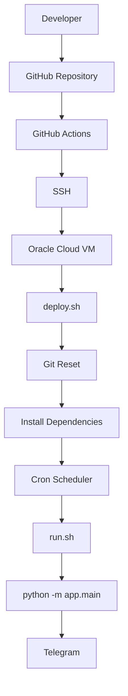

# Deployment Guide

This document describes the complete deployment process for the AI News Telegram Bot to an Oracle Cloud Always Free Virtual Machine (VM).

The deployment strategy separates **deployment** from **application execution**:

- **GitHub Actions** deploys the latest code.
- **Oracle Cloud VM** hosts the application.
- **Linux Cron** runs the bot every day.

---

# Table of Contents

- Deployment Overview
- Architecture
- Prerequisites
- Oracle Cloud VM Setup
- Local SSH Configuration
- Clone the Repository
- Create Python Environment
- Configure Environment Variables
- Configure Deployment Script
- Configure GitHub Actions
- Configure Cron Scheduler
- Verify Deployment
- Updating the Application
- Troubleshooting

---

# Deployment Overview

The production environment consists of:

| Component | Purpose |
|------------|---------|
| GitHub | Source Code Repository |
| GitHub Actions | Automated Deployment |
| Oracle Cloud VM | Application Hosting |
| Ubuntu Linux | Operating System |
| Python Virtual Environment | Runtime |
| Cron | Daily Scheduler |
| Telegram | Message Delivery |

---

# Deployment Architecture



---

# Prerequisites

Before deployment, ensure you have:

- Oracle Cloud Account
- Oracle Cloud Always Free VM
- Ubuntu 24.04 LTS
- GitHub Repository
- SSH Key Pair
- Telegram Bot Token
- Telegram Chat ID
- Gemini/OpenAI API Key

---

# Oracle Cloud VM Setup

## Create Compute Instance

Recommended configuration:

| Setting | Value |
|----------|-------|
| Image | Ubuntu 24.04 LTS |
| Shape | VM.Standard.A1.Flex |
| OCPU | 1 |
| Memory | 6 GB |
| Boot Volume | Default (Always Free Eligible) |
| Network | Public Subnet |
| Public IP | Enabled |
| SSH Keys | Generated or Uploaded |

---

## Connect to VM

```bash
ssh -i <private-key> ubuntu@<PUBLIC_IP>
```

Example:

```bash
ssh -i oracle_key ubuntu@129.xxx.xxx.xxx
```

---

# Clone Repository

Create a workspace.

```bash
mkdir -p ~/projects

cd ~/projects
```

Clone the repository.

```bash
git clone https://github.com/harishbabus/AI-News-Telegram-Bot.git

cd AI-News-Telegram-Bot
```

---

# Create Python Virtual Environment

```bash
python3 -m venv .venv
```

Activate it.

```bash
source .venv/bin/activate
```

Install dependencies.

```bash
pip install -r requirements.txt
```

---

# Configure Environment Variables

Create a `.env` file in the project root.

Example:

```env
BOT_TOKEN=xxxxxxxxxxxxxxxx

CHAT_ID=-100xxxxxxxx

AI_PROVIDER=gemini

GEMINI_API_KEY=xxxxxxxxxxxxxxxx

OPENAI_API_KEY=xxxxxxxxxxxxxxxx
```

The `.env` file should **never** be committed to Git.

---

# Verify Local Execution

Run the application.

```bash
python3 -m app.main
```

If successful:

- News is fetched
- AI summary is generated
- Telegram message is delivered

Only continue with deployment after local execution succeeds.

---

# Configure Deployment Script

Deployment is handled by:

```
scripts/deploy.sh
```

Example:

```bash
#!/bin/bash

set -e

echo "===== Deployment Started ====="

cd ~/projects/AI-News-Telegram-Bot

git fetch origin

git reset --hard origin/main

source .venv/bin/activate

pip install -r requirements.txt

echo "===== Deployment Complete ====="
```

Using:

```bash
git reset --hard origin/main
```

ensures the VM always matches the latest version in GitHub.

---

# Configure GitHub Actions

Deployment is triggered automatically whenever changes are pushed to the `main` branch.

Workflow:

```
.github/workflows/deploy.yml
```

Typical workflow:

```yaml
on:
  push:
    branches:
      - main
```

The workflow:

1. Connects to the Oracle VM via SSH
2. Executes `deploy.sh`
3. Updates the application

---

# Configure GitHub Secrets

Store the following repository secrets:

| Secret | Description |
|---------|-------------|
| VM_HOST | Oracle VM Public IP |
| VM_USER | Ubuntu |
| VM_SSH_KEY | Private SSH Key |

These values allow GitHub Actions to authenticate securely with the VM.

---

# Configure Cron Scheduler

The application is executed daily using Linux Cron.

Edit the user's crontab.

```bash
crontab -e
```

Example:

```cron
30 1 * * * /bin/bash /home/ubuntu/projects/AI-News-Telegram-Bot/scripts/run.sh
```

This runs every day at:

```
07:00 IST
```

---

# run.sh

Example:

```bash
#!/bin/bash

set -e

cd /home/ubuntu/projects/AI-News-Telegram-Bot

source .venv/bin/activate

python3 -m app.main
```

Make the script executable.

```bash
chmod +x scripts/run.sh
```

---

# Verify Cron

View scheduled jobs.

```bash
crontab -l
```

Check Cron service.

```bash
sudo systemctl status cron
```

Review execution logs.

```bash
grep CRON /var/log/syslog
```

---

# Verify Deployment

## Latest Commit

```bash
git log --oneline -5
```

---

## Repository Status

```bash
git status
```

Expected output:

```
working tree clean
```

---

## Run Application

```bash
python3 -m app.main
```

---

## Verify Telegram

Confirm:

- Digest received
- Summary generated
- Formatting correct

---

# Updating the Application

Normal workflow:

```text
Developer

↓

git commit

↓

git push

↓

GitHub Actions

↓

Oracle Cloud VM

↓

deploy.sh

↓

Application Updated
```

No manual deployment is required.

---

# Log Files

Application logs:

```
logs/
```

System logs:

```bash
/var/log/syslog
```

Useful commands:

```bash
tail -f logs/app.log
```

```bash
grep CRON /var/log/syslog
```

---

# Troubleshooting

## GitHub Action succeeds but server is not updated

Check:

```bash
git status
```

If there are local modifications, reset the repository.

```bash
git reset --hard origin/main
```

---

## SSH Authentication Failed

Verify:

- Public IP
- SSH Private Key
- Port 22
- Security List

---

## Permission Denied

Make deployment scripts executable.

```bash
chmod +x scripts/deploy.sh

chmod +x scripts/run.sh
```

---

## Module Import Error

Always execute using:

```bash
python3 -m app.main
```

Avoid:

```bash
python app/main.py
```

when using package-based imports.

---

## Cron Job Fails

Verify:

```bash
crontab -l
```

Check:

```bash
cat scripts/run.sh
```

Ensure the command is:

```bash
python3 -m app.main
```

Review logs:

```bash
grep CRON /var/log/syslog
```

---

## Environment Variables Missing

Verify:

```bash
cat .env
```

Required values:

- BOT_TOKEN
- CHAT_ID
- AI_PROVIDER
- GEMINI_API_KEY
- OPENAI_API_KEY

---

# Security Considerations

- Never commit `.env`.
- Store API keys only on the server.
- Use GitHub Secrets for deployment credentials.
- Restrict SSH access to trusted users.
- Rotate API keys if compromised.

---

# Deployment Checklist

Before declaring a deployment successful, verify:

- Oracle VM is running
- SSH connectivity works
- Repository is up to date
- Virtual environment is active
- Dependencies are installed
- `.env` exists
- `python3 -m app.main` executes successfully
- Cron entry exists
- Cron service is running
- Telegram digest is delivered

---

# Future Improvements

Potential enhancements include:

- Docker-based deployment
- Nginx reverse proxy (if exposing web endpoints)
- Terraform for infrastructure provisioning
- Automatic health checks
- Monitoring and alerting
- Multi-environment deployments (Development, Staging, Production)
- Automated backups

---

# Summary

The deployment architecture is designed to be simple, reliable, and cost-effective.

- **GitHub** manages the source code.
- **GitHub Actions** automates deployments.
- **Oracle Cloud Always Free VM** hosts the application.
- **Linux Cron** handles scheduled execution.
- **Telegram** delivers the daily AI news digest.

This separation of responsibilities keeps deployments predictable while ensuring the application runs independently of GitHub's scheduling infrastructure.

## Related Documentation

- README.md — Project overview and quick start
- ARCHITECTURE.md — System design and module interactions
- DEVELOPMENT.md — Local development and contribution guide
- DEPLOYMENT.md — Oracle Cloud deployment instructions
- CI_CD.md — Deployment automation pipeline